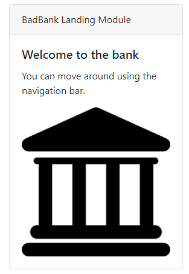

# Bad Piggy Bank
This is the Bad Piggy Bank Project 

# Description   
    This actualy a learning project for Class at MITxPro.  
    It is one of the assignments and almost contained everything I have learned so far in this class. 
    There are many areas that need imporving, in design, structure, orginzation, code and deployment.  

    It is a basicaly a mock bank with no security at the moment.  
    It will have most of the things such as Deppsit, Withdrawl, Login page, and balance page.   

# Installation 
    Pull requests are welcome. For major changes, please open an issue first to discuss what you would like to change.

# Tech
    This is using MongoDB, Express, React and Node.js.

# In The Works 
    1. Finish modules for diffrent types of transactions
    2. Update each of the routes correctly. Most likey a refactor is needed. 
    3. Add secuirty login.  Will be using Firebase.   

# License
MIT License Copyright (c) 2021 Stephan Wong Permission is hereby granted, free of charge, to any person obtaining a copy of this software and associated documentation files (the "Software"), to deal in the Software without restriction, including without limitation the rights to use, copy, modify, merge, publish, distribute, sublicense, and/or sell copies of the Software, and to permit persons to whom the Software is furnished to do so, subject to the following conditions: The above copyright notice and this permission notice shall be included in all copies or substantial portions of the Software. THE SOFTWARE IS PROVIDED "AS IS", WITHOUT WARRANTY OF ANY KIND, EXPRESS OR IMPLIED, INCLUDING BUT NOT LIMITED TO THE WARRANTIES OF MERCHANTABILITY, FITNESS FOR A PARTICULAR PURPOSE AND NONINFRINGEMENT. IN NO EVENT SHALL THE AUTHORS OR COPYRIGHT HOLDERS BE LIABLE FOR ANY CLAIM, DAMAGES OR OTHER LIABILITY, WHETHER IN AN ACTION OF CONTRACT, TORT OR OTHERWISE, ARISING FROM, OUT OF OR IN CONNECTION WITH THE SOFTWARE OR THE USE OR OTHER DEALINGS IN THE SOFTWARE.

